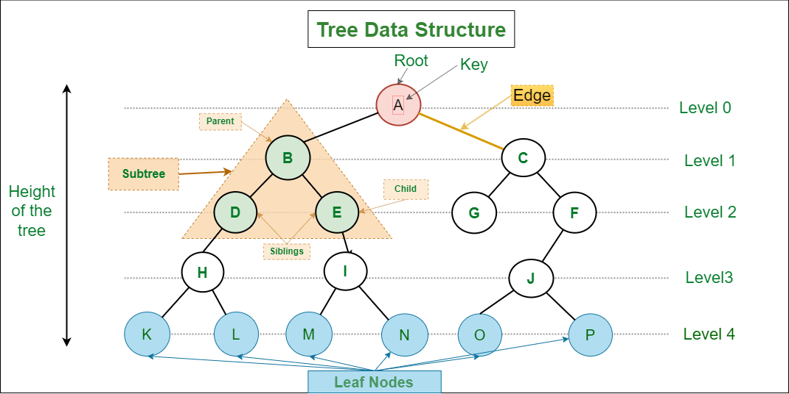

## Tree Data Structure 🌳

A tree data structure is a hierarchical structure that is used to represent and organize data in a way.

- Topmost node of the tree is called the root.
- Nodes below of root are called the child nodes.
- These child nodes can also be recursive structure.
  

### Basic Terminologies
- **Parent Node**: which is a predecessor of a node is called the parent node of that node. **{B} is parent of {D,E}**
- **Child Node**: which is the immediate successor of a node. **{D,E} are the child nodes of {B}**
- **Root Node**: topmost node of a tree or that not have any parent node.
- **Leaf Node or External Node**: which is not have any child nodes.
- **Ancestor of a Node**: Any predecessor nodes on the path of the root to that node.
- **Descendant**: Any successor node on the path from the leaf to the node.